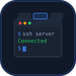

<p align="center">
  
</p>

<h1 align="center">PuttyAlt</h1>
<p align="center"><code>The SSH client PuTTY refused to become.</code></p>

<br>

<p align="center">
  <a href="https://github.com/chillymasterio/puttyalt/releases/latest"></a>
  <a href="https://github.com/chillymasterio/puttyalt/actions"></a>
  <a href="LICENCE"></a>
  <a href="https://github.com/chillymasterio/puttyalt/stargazers"></a>
</p>

<br>

> **20 years of wishlists. 24 features the author officially rejected. Zero active forks.**
>
> PuTTY is the most trusted SSH engine on the planet. But its UI froze in 1999 and the developer [actively opposes](https://www.chiark.greenend.org.uk/~sgtatham/putty/wishlist/) the features millions of sysadmins need daily.
>
> PuttyAlt changes that.

---

## The Problem

You manage 40 servers. You open PuTTY. Now you have 40 windows. You alt-tab through chaos. You copy an IP, open WinSCP separately, navigate again. You paste a password from a text file because PuTTY can't save them. Your connection drops at 3 AM — PuTTY just sits there with a dead window.

Meanwhile, MobaXterm charges $69/year for tabs. SecureCRT wants $119 for scripting. You pay, or you suffer.

**That's the world we're ending.**

## The Solution

PuttyAlt = PuTTY 0.83 engine (including post-quantum ML-KEM) + everything that was missing:

```
 [Tab 1: prod-web-01] [Tab 2: prod-db-01] [Tab 3: staging] [+]
 ┌─────────────────────────────────────────┬──────────────────┐
 │ $ ssh admin@prod-web-01                 │  SFTP            │
 │ Last login: Mon May 12 09:41:02 2026    │  /var/www/html/  │
 │                                         │  ├── index.html  │
 │ admin@prod-web-01:~$ █                  │  ├── app.js      │
 │                                         │  └── config.yml  │
 │                                         │                  │
 │                                         │  [Upload] [Sync] │
 └─────────────────────────────────────────┴──────────────────┘
 Sessions ▸ Production (12) | Staging (4) | Dev (8)     [Snippet: restart nginx ▸]
```

## What's Inside

```
Tabs                   — 40 servers, 1 window
Session Manager        — folders, search, color-coded environments
SFTP Panel             — drag & drop files next to your terminal
Portable Mode          — files, not registry. runs from USB
Auto-Reconnect         — connection dies, PuttyAlt retries
Saved Credentials      — AES-256 encrypted, master password
Lua Scripting          — automate anything
Command Snippets       — one-click frequent commands
Multi-Input            — type once, send to 10 servers
Triggers               — "if output contains ERROR → alert me"
Terminal Search        — Ctrl+Shift+F to search scrollback
Key Manager            — auto-discover and select SSH keys
Env Indicator          — colour stripes for prod/staging/dev
Quick Connect          — Ctrl+K URI bar: ssh://user@host:port
```

## What's NOT Inside

```
Electron               — we're native C. 3 MB, not 300 MB
Telemetry              — we don't know who you are. we don't want to
Subscriptions          — free forever. MIT license
Bloat                  — no built-in text editor, no web browser, no AI
```

## PuTTY vs Everyone

| | PuTTY | KiTTY | MobaXterm | SecureCRT | **PuttyAlt** |
|---|:---:|:---:|:---:|:---:|:---:|
| **Tabs** | no | no | $69/yr | $119 | **free** |
| **SFTP panel** | no | no | $69/yr | no | **free** |
| **Scripting** | no | no | $69/yr | $119 | **free** |
| **Portable** | no | yes | yes | no | **yes** |
| **Open source** | yes | yes | no | no | **yes** |
| **SSH engine** | 0.83 | 0.76 | ? | ? | **0.83** |
| **Post-quantum** | yes | no | no | no | **yes** |
| **Alive** | yes | died 2023 | yes | yes | **yes** |

KiTTY hasn't been updated since September 2023. It's stuck on PuTTY 0.76 — missing 2 years of security patches. SuperPuTTY has 356 open issues and no maintainer. PuTTYTray is archived with a warning "shouldn't be used."

**There is no maintained, open-source, feature-rich PuTTY fork. Until now.**

## Get It

**Portable** — download, unzip, run. No install. No admin rights. No registry.

| Platform | |
|---|---|
| Windows x64 | [Download](https://github.com/chillymasterio/puttyalt/releases/latest) |
| Windows x86 | [Download](https://github.com/chillymasterio/puttyalt/releases/latest) |
| Windows ARM64 | [Download](https://github.com/chillymasterio/puttyalt/releases/latest) |

Or build it yourself in 30 seconds:

```bash
git clone https://github.com/chillymasterio/puttyalt.git
cd puttyalt
cmake -B build
cmake --build build --config Release
```

## Where We're Going

```
v0.1  Foundation         ██████████░░░░░░░░░░  in progress
      portable mode, auto-reconnect, remember window position

v0.2  Tabs & Sessions    ░░░░░░░░░░░░░░░░░░░░  planned
      tabbed interface, session folders, search, color-coding

v0.3  File Transfer      ░░░░░░░░░░░░░░░░░░░░  planned
      built-in SFTP panel, drag & drop

v0.4  Automation         ░░░░░░░░░░░░░░░░░░░░  planned
      Lua scripting, snippets, multi-input, triggers
```

## Under the Hood

```
Language        C99 (pure C, not C++)
Engine          PuTTY 0.83 — battle-tested since 1999
Build           CMake
Binary size     ~3 MB
Dependencies    zero (Win32 API only)
License         MIT — do whatever you want
Crypto          AES, ChaCha20, Ed25519, ECDSA, RSA, ML-KEM (post-quantum)
Protocols       SSH-2, SSH-1, Telnet, Rlogin, Raw, Serial, SUPDUP
```

**Key files if you want to hack on it:**

| File | Lines | What |
|---|---|---|
| `terminal/terminal.c` | 8,185 | Terminal emulator core |
| `windows/window.c` | 5,950 | Main window — this is where tabs will live |
| `config.c` | 3,355 | Settings UI — session manager goes here |
| `windows/storage.c` | 700 | Registry storage — replacing with file-based |
| `ssh/sftp.c` | 840 | SFTP protocol — engine for the file panel |
| `puttyalt_sessions.c` | 350 | Session manager with folders and tags |
| `puttyalt_broadcast.c` | 90 | Multi-input broadcast to many sessions |
| `puttyalt_termsearch.c` | 100 | Terminal scrollback text search |
| `puttyalt_triggers.c` | 160 | Pattern-based terminal output triggers |

## Contributing

```bash
# 1. fork it
# 2. branch it
git checkout -b feature/something-awesome
# 3. code it
# 4. push it
# 5. PR it
```

Read [CONTRIBUTING.md](CONTRIBUTING.md) for details. Look at [open issues](https://github.com/chillymasterio/puttyalt/issues) for ideas.

**We especially welcome:**
- Windows GUI developers (Win32/C)
- People who use SSH daily and have opinions
- Security researchers
- Translators

## Security

PuTTY's engine is trusted by millions. We don't break that trust.

- All upstream security patches merged within 48 hours
- No telemetry, no analytics, no network calls except your SSH connection
- Credential encryption uses AES-256-GCM
- Found a vulnerability? [Report privately](https://github.com/chillymasterio/puttyalt/security/advisories/new)

## Acknowledgments

PuttyAlt exists because [Simon Tatham](https://www.chiark.greenend.org.uk/~sgtatham/putty/) spent 25 years building the most reliable SSH implementation on Windows. We're standing on the shoulders of a giant. Thank you, Simon.

---

<p align="center">
<sub>PuttyAlt is not affiliated with or endorsed by the PuTTY project.</sub>
</p>
